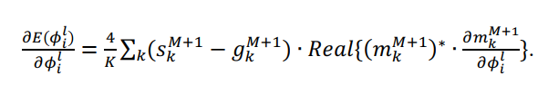
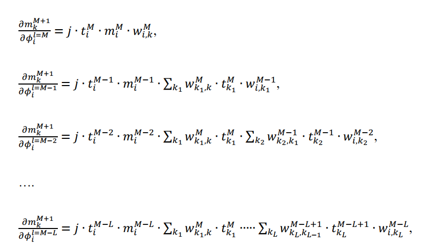
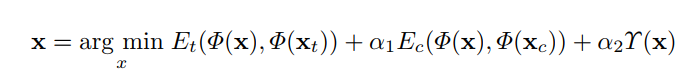
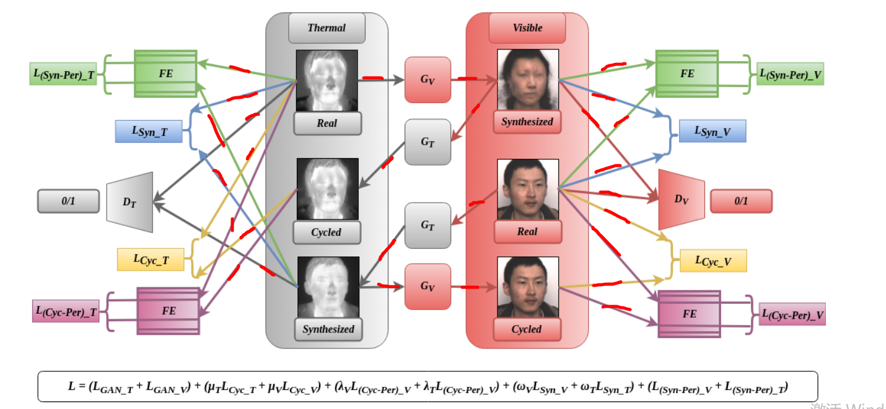

# Thesis related to graduation project
<!-- TOC -->

- [Thesis related to graduation project](#thesis-related-to-graduation-project)
    - [衍射深度学习框架](#衍射深度学习框架)
        - [All-optical machine learning using diffractive deep neural networks](#all-optical-machine-learning-using-diffractive-deep-neural-networks)
        - [Hybrid optical-electronic convolutional neural networks with optimized diffractive optics for image classification](#hybrid-optical-electronic-convolutional-neural-networks-with-optimized-diffractive-optics-for-image-classification)
        - [Analysis of Diffractive Optical Neural Networks and Their Integration With Electronic Neural Networks](#analysis-of-diffractive-optical-neural-networks-and-their-integration-with-electronic-neural-networks)
        - [Optical Frontend for a Convolutional Neural Network](#optical-frontend-for-a-convolutional-neural-network)
        - [Optronic convolutional neural networks of multi-layers with different functions executed in optics for image classification](#optronic-convolutional-neural-networks-of-multi-layers-with-different-functions-executed-in-optics-for-image-classification)
        - [Class-specific differential detection in diffractive optical neural networks improves inference accuracy](#class-specific-differential-detection-in-diffractive-optical-neural-networks-improves-inference-accuracy)
    - [纳米光子电路和光子神经网络](#纳米光子电路和光子神经网络)
        - [Deep learning with coherent nanophotonic circuits](#deep-learning-with-coherent-nanophotonic-circuits)
        - [All-optical neural network with nonlinear activation functions](#all-optical-neural-network-with-nonlinear-activation-functions)
        - [Reprogrammable Electro-Optic Nonlinear Activation Functions for Optical Neural Networks](#reprogrammable-electro-optic-nonlinear-activation-functions-for-optical-neural-networks)
        - [High-accuracy optical convolution unit architecture for convolutional neural networks by cascaded acousto-optical modulator arrays](#high-accuracy-optical-convolution-unit-architecture-for-convolutional-neural-networks-by-cascaded-acousto-optical-modulator-arrays)
    - [GAN实现图像翻译任务](#gan实现图像翻译任务)
        - [Image-to-Image Translation with Conditional Adversarial Networks](#image-to-image-translation-with-conditional-adversarial-networks)
        - [Sparse GANs for Thermal Infrared Image Generation From Optical Image](#sparse-gans-for-thermal-infrared-image-generation-from-optical-image)
        - [U-Net: Convolutional networks for biomedical image segmentation](#u-net-convolutional-networks-for-biomedical-image-segmentation)
        - [Unpaired Image-to-Image Translation using Cycle-Consistent Adversarial Networks](#unpaired-image-to-image-translation-using-cycle-consistent-adversarial-networks)
        - [DualGAN: Unsupervised Dual Learning for Image-to-Image Translation](#dualgan-unsupervised-dual-learning-for-image-to-image-translation)
        - [Precomputed Real-Time Texture Synthesis with Markovian Generative Adversarial Networks(PatchGAN)](#precomputed-real-time-texture-synthesis-with-markovian-generative-adversarial-networkspatchgan)
        - [Perceptual Losses for Real-Time Style Transfer and Super-Resolution](#perceptual-losses-for-real-time-style-transfer-and-super-resolution)
        - [Perceptual Adversarial Networks for Image-to-Image Transformation](#perceptual-adversarial-networks-for-image-to-image-transformation)
        - [Generating Images with Perceptual Similarity Metrics based on Deep Networks](#generating-images-with-perceptual-similarity-metrics-based-on-deep-networks)
        - [Progressively Unfreezing Perceptual GAN](#progressively-unfreezing-perceptual-gan)
        - [PCSGAN: Perceptual Cyclic-Synthesized Generative Adversarial Networks for Thermal and NIR to Visible Image Transformation](#pcsgan-perceptual-cyclic-synthesized-generative-adversarial-networks-for-thermal-and-nir-to-visible-image-transformation)
        - [Image manipulation with perceptual discriminators](#image-manipulation-with-perceptual-discriminators)
        - [TV-GAN: Generative Adversarial Network Based Thermal to Visible Face Recognition](#tv-gan-generative-adversarial-network-based-thermal-to-visible-face-recognition)
    - [特殊传感器实现深度神经网络层](#特殊传感器实现深度神经网络层)
        - [ASP Vision Optically Computing the First Layer of Convolutional Neural Networks using Angle Sensitive Pixels](#asp-vision-optically-computing-the-first-layer-of-convolutional-neural-networks-using-angle-sensitive-pixels)
    - [其他](#其他)
        - [Fast Training of Convolutional Networks through FFTs](#fast-training-of-convolutional-networks-through-ffts)
        - [Perceptual-Sensitive GAN for Generating Adversarial Patches](#perceptual-sensitive-gan-for-generating-adversarial-patches)
        - [Perceptual Generative Adversarial Networks for Small Object Detection](#perceptual-generative-adversarial-networks-for-small-object-detection)
        - [Face aging with conditional generative adversarial networks](#face-aging-with-conditional-generative-adversarial-networks)
        - [Invertible Conditional GANs for image editing](#invertible-conditional-gans-for-image-editing)
        - [Face Aging With Identity-Preserved Conditional Generative Adversarial Networks](#face-aging-with-identity-preserved-conditional-generative-adversarial-networks)
        - [Single Image Haze Removal Using Dark Channel Prior](#single-image-haze-removal-using-dark-channel-prior)
    - [超表面(Metasurface)](#超表面metasurface)
    - [可见光图像与红外图像模态关系专栏](#可见光图像与红外图像模态关系专栏)
        - [Heterogeneous Face Recognition: Recent Advances in Infrared-to-Visible Matching](#heterogeneous-face-recognition-recent-advances-in-infrared-to-visible-matching)
        - [Face Matching Between Near Infrared and Visible Light Images](#face-matching-between-near-infrared-and-visible-light-images)
        - [Transferring Deep Representation for NIR-VIS Heterogeneous Face Recognition](#transferring-deep-representation-for-nir-vis-heterogeneous-face-recognition)
        - [NIR-VIS Heterogeneous Face Recognition via Cross-Spectral Joint Dictionary Learning and Reconstruction](#nir-vis-heterogeneous-face-recognition-via-cross-spectral-joint-dictionary-learning-and-reconstruction)
        - [Deep Perceptual Mapping for Cross-Modal Face Recognition](#deep-perceptual-mapping-for-cross-modal-face-recognition)
        - [Real-Time Monitoring of Heart Rate by Processing of Near Infrared Generated Streams](#real-time-monitoring-of-heart-rate-by-processing-of-near-infrared-generated-streams)
    - [图像生成方法](#图像生成方法)
        - [Pixel Recurrent Neural Networks](#pixel-recurrent-neural-networks)
        - [Conditional image generation with PixelCNN decoders](#conditional-image-generation-with-pixelcnn-decoders)
        - [WAVENET: A GENERATIVE MODEL FOR RAW AUDIO](#wavenet-a-generative-model-for-raw-audio)
        - [VAE (variational autoencoder)](#vae-variational-autoencoder)
        - [马尔可夫链生成模型](#马尔可夫链生成模型)
        - [GAN相比于以上方法的优势和缺点](#gan相比于以上方法的优势和缺点)

<!-- /TOC -->
## 衍射深度学习框架
### All-optical machine learning using diffractive deep neural networks
>X. Lin, Y. Rivenson, N. T. Yardimci, M. Veli, Y. Luo, M. Jarrahi, and A. Ozcan, "All optical machine learning using diffractive deep neural networks," in *Science* , 2018. 

本篇论文是全光衍射深度神经网络的开山之作。用太赫兹作为相干光源照射图像(Mask)，图像不同位置的透光率不同，因此产生与图像特征相关的二次衍射波(Secondary Waves)作为深度网络的输入。之后经过 Figure.1A 的各个衍射层 L，对不同位置的波进行调制，最后输出到检测器(Detector Array)中，检测器检测不同位置光强的大小，如 Figure.1B 所示，手写数字识别就对应着 10 类，因此设置 10 个检测器。检测器检测到的输出，与期望输出之间的差值，可以当作 Loss 。而正向传递过程衍射层的厚度、材料等会对波的相位(振幅)有着调制作用，也是需要训练的参数，合适的衍射层厚度会让波在对应的检测点处相干振幅最大，以达到分类的目的。若使用特定的薄的纯相衍射层，则不会对波的振幅产生影响，称为 phase-only object modulation。层与层之间的距离 $d1,d2,d3 ......$ 也可作为训练参数，手写数字识别中 $d=3cm$，ImageNet 图像识别中 $d = 4mm$。层与层更长的间距对应着更多的连接数，毕竟衍射在大的偏角 $\theta$ 下波的强度会很小，可忽略相应的连接。Figure.1D 将全光衍射深度网络与普通的深度神经网络(Electronic Neural Network)进行了对比，主要区别就是前者的矩阵都是复矩阵，毕竟衍射过程以及相幅变化都是用傅里叶光学相关公式进行推导的，而下面介绍完衍射相关公式我们就知道这整个过程也是线性的，不同的是前者权值矩阵 $W$ 是由自由空间衍射、不同位置相干波干涉、衍射层对光场相位(幅值)调制，三部分综合而成。$Y$ 就是对应层的光场，$B$ 作为偏置项(目前不清楚怎么实现的这个偏置)。同样光学非线性 $F$ 也可用于全光衍射深度网络。  

 

 
摸清各个部分后，我们便可以开始反向传递的推导。这里的自用空间衍射公式采用 Rayleigh-Sommerfeld diffraction equation： 

 

 

$l$ 代表第 $l$ 层，$i$ 代表位于 $(x_i,y_i,z_i)$ 的神经元，于是输出形式见如下公式。三项分别的含义：第$L$层的衍射特性 $w$ (Rayleigh-Sommerfeld 原理决定)，第 $L-1$ 层到 $L$ 层的传递特性 $t$ (振幅和相位的改变)
经过前 $n-1$ 层各神经元的输出 $Σ_k$：  

 

 
我们可以简写为如下形式： 

 

 
探测器探测光强分布： 

 

 

损失函数 $E$，$g$ 代表期望光强分布 ：
 

 

 
优化目标：
 

 

 
梯度： 

 

 
各层梯度计算方法： 

 

 

### Hybrid optical-electronic convolutional neural networks with optimized diffractive optics for image classification
>J. Chang, V. Sitzmann, X. Dun, W. Heidrich and G. Wetzstein, “Hybrid optical-electronic convolutional neural networks with optimized diffractive optics for image classification,” in Scientific Reports, vol. 8, no. 1, p. 12324, 2018.

本篇文章用光学前端+传统神经网络(全连接层)后端实现图像分类。最主要的创新点在于对卷积层的光学替代，虽然实验中只替换了一层，但在不太影响准确度的情况下大大降低了计算量。 

 

 
传统的卷积层使用多个 kernel 对原图像进行"扫描"，得到卷积后图像，但光学中我们不能实现 kernel 的纵向排列，依次"扫描"原图像，我们只能对 kernel 进行平铺，然后构造非相干光光学线性系统，对入射光强实现卷积操作，如下图(c)所示。 

 

 
该非相干光线性系统对光强的传播公式如下，PSF(point spread function)即常说的系统的脉冲响应: 

 

 
而又因为不同的 kernel 存在水平和垂直两个方向的位移差，则我们可以将脉冲响应写为如下的卷积和公式(与冲激函数 δ 卷积表示空间上的位移)： 

 

 
我们知道，4f非相干光线性系统中的 PSF 又与上图(a)中 Fourier plane(phase mask) 的透过率函数( aperture transfer function
(ATF) )有关，具体公式如下： 

 

 

而如果我们只考虑相位(phase-only)，则 ATF 中的 $A(k_x,k_y)恒为1$， 则最终目标如下： 

 

 

 
于是整体策略如下所示：
 

 

 
在实验中，因为光学 kernel 无法实现负参数，于是，作者将一半 kernel 的 PSF 人工设置为负，经过此项处理精确度由上表36.3% 回到正常的 51.8%。
 
在Supplementary Information中提到了非相干 ONN 的限制： 

- 不能引入 bias
- PSF 不能为负

于是如果有条件使用相干光照明则可以解决第二项。 
>此论文有仿真代码

### Analysis of Diffractive Optical Neural Networks and Their Integration With Electronic Neural Networks
>D. Mengu, Y. Luo, Y. Rivenson and A. Ozcan, “Analysis of diffractive optical neural networks and their integration with electronic neural networks,” in Journal Selection Topics in Quantum Electron, vol. 26, no. 1, pp. 1-14, 2019.

本篇论文并没有像上文一样提出一种新的卷积思路，而是对开山之作[All-optical machine learning using diffractive deep neural networks[1]](※All-optical-machine-learning-using-diffractive-deep-neural-networks.pdf)的一个思路延申和分析改良。
改良点、分析点如下：

- 缓和[1]中梯度消失的问题
- 分析不同层间距和有无振幅变化参数对结果的影响
- 分析不同 Loss 函数：softmax-cross-entropy (SCE)、softmax-cross-entropy (SCE) 对分类精确度、衍射光效率、输出对比度的影响
- 分析全光衍射神经网络"深度(depth)"特点
- 对比层间距对分类精度的影响
- 分析全光衍射层与电神经网络连接的探测器阵列(detector array)尺寸、连接到不同电神经网络对分类结果的影响

下图是个简要的实验思路图

 

 
实验数据变量相关表格：
 

 

### Optical Frontend for a Convolutional Neural Network
>S. Colburn, Y. Chu, E. Shlizerman and A. Majumdar, "Optical Frontend for a Convolutional Neural Network," , in Applied Optics, vol. 58, issue 12, pp. 3179-3186, 2019.

本篇文章与本文第二篇 *Hybrid optical-electronic convolutional neural networks with optimized diffractive optics for image classification* 类似，都是使用 4f 相关器实现非相干光线性系统，输入图像光与其中的 mask 实现神经网络中第一层卷积操作。不过，本文中除了卷积操作的实现，还把非相干光线性系统中的光强传递特性考虑为二次非线性，并采用对 Alexnet 第一层进行替换。为了保证物理上的可实现性，去掉了Alexnet 第一层的 ReLu 非线性激活函数，换为平方非线性(square nonlinearity)，去掉了物理上不可实现的 bias 向量。于是就有了系统物理仿真的替换掉 Alexnet 第一层的网络，称之为 OPCNN-L1 和 纯电子的修改了第一层后的 Alexnet ，称之为 AlexNet SQNL。分别进行图像分类测试，结果如下：
 

 
我们看到 (C3)(C4) 结果相近，说明替换是有效的。还需强调的是，本篇论文采用的是透镜阵列(lenslet array)来实现并行的卷积操作，模拟多个 kernel 的情况，通过 P6 的相关证明，可得这样的阵列中，每个透镜之间的串扰(crosstalk)可以忽略不计。透镜阵列的实现基于可见区域高效超表面的平面光学(flat optics based on visible regime efficient metasurfaces )。并且为了实现一般的复值二维掩模，提出利用一种相位超表面，利用以前在纯相位空间光调制器(SLMs)中使用的技术来实现一般的复值函数。 
本文还通过公式推导了 OPCNN-L1 的短延迟、低能耗、对图像尺寸不敏感(ultra-broad bandwidth)的特点。  

>本文有仿真代码，看起来简单易行

### Optronic convolutional neural networks of multi-layers with different functions executed in optics for image classification
>Y. Gu, S. Gao, and Z. Liu, "Optronic convolutional neural networks of multi-layers with different functions executed in optics for image classification," in Optics Express, vol. 29, no. 4, pp. 5877-5889, 2021.

本篇文章给我们提供了一种纯光学卷积神经网络计算系统。系统包括卷积层，池化层，非线性激活层，全连接层，每一层的计算都是由光学完成，只有数据之间的传递会用到电子完成。并且，不同于其他的光电卷积神经网络，这种系统易于扩展，即可以通过对相关设备的复用来增加卷积层数。 
首先卷积层利用空间光调制器(SLMs)和傅里叶透镜阵列实现，下采样(池化层)采用光学步进卷积(optical-strided convolution )实现，非线性采用sCOMS相机曲线实现，全连接层采用光学点积实现。 
相关背景：现有的光神经网络分为两个框架，一种是利用透射层(或反射层)上每个点之间的空间光衍射来模拟神经元之间的信息传输，另一个框架由光学干涉单元和光学非线性单元构成，如相干纳米光子电路和光子神经网络。对于CNNs的实现而言，使用光学4f系统比使用声光调制器阵列建立光学卷积单元结构是更好的实现卷积的方法。 
系统整体框架如下: 

 

 
红色虚线就是设备复用情况，如果我们从 C1 得到非线性激活后的数据之后，若还需要卷积处理，则将数据传入 SLM1，如果不需要卷积，直接传入 SLM5 进行全连接层处理。这两部分是由电子数据传输完成，而其它部分则是纯光学计算。 
对于卷积层，这里可以并行处理多个图像。对于下采样层，可以由 L1,L2 的焦距设置不同的采样间隔。对于非线性激活层的 C1 sCMOS 曲线我们可以人工调整，来实现不同的非线性激活函数，如 ReLu 等，它是通过改变输入与输出图像光强关系来实现的。对于全连接层，输入图像和kernel之间的元素乘积是通过两个SLMs之间的光的反射来实现的(这里不太清楚细节原理)。最后的图像分类，我们通过观察 C2 输出来确定类别，预测的类别对应最大艾里斑强度。

### Class-specific differential detection in diffractive optical neural networks improves inference accuracy
>X. Li, D. Mengu, Y. Luo, Y. Rivenson, A. Ozcan, "Class-specific differential detection in diffractive optical neural networks improves inference accuracy", in Advanced Photonics, vol. 1, no. 4, pg. 046001, 2019.

本文改良了全光衍射深度神经网络对光强非负性的限制。文中提供了三种改良措施，如下图所示： 

 

 

(a)为普通的衍射神经网络设计，*D([10,0],[1,5,40k])* 表示有十个正类别探测器，零个负类别探测器，一个神经网络，五个衍射层，每层 40k 个神经元。下面(b)(c)(d)同理。通过这样的设计，衍射神经网络输出检测信号的非负性通过差分检测方案得到了缓解，该方案在输出平面上每个数据类使用两个光电探测器。在该差分检测方案中，每一类的输出信号用对应检测器对信号的归一化差表示。因此，光电探测器的一半占输出信号的正部分，另一半占输出信号的负部分。衍射光学网络的最终推论是简单地基于这两个分别代表不同类别的正负探测器对所检测到的最大差分信号。 

 

 
上图是 Differential design 对 MINST 数据集的分类过程，虚线框出的则是差分单元。类似的 Differential design 还可以如下所示： 

 

 
Class-specific design 如下图所示，每个探测器不分正负： 

 

 
最后作者从神经网络中 bagging 和 ensemble 的方法中受到启发，使用独立优化的多个衍射神经网络组成一个整体，并假设每个光网络的衍射光信号与其他网络的衍射光叠加在包含光电探测器的同一输出平面上，并得到了良好的效果。 

## 纳米光子电路和光子神经网络

### Deep learning with coherent nanophotonic circuits
>C. Shen, N. Harris, S. Skirlo, et al,"Deep learning with coherent nanophotonic circuits", in Nature Photon, 2017. 
 [相关报道](https://www.sohu.com/a/148450779_465975)

本篇文章介绍了不同于全光衍射神经网络的一种新式光学神经网络框架，并且将该框架应用于芯片开发，称之为可编程纳米光子处理器。该体系结构可应用于其他大量使用矩阵乘法和非线性激活的人工神经网络算法，包括卷积神经网络和递归神经网络。 
我们都知道一个透镜就可以实现图像的傅里叶变换，4f 系统就可以实现对图像进行卷积运算，然而，由于需要相位稳定和大量神经元数量，用大块光学元件(如光纤和透镜)实现这种转换一直是一个主要障碍，集成光子学通过提供一个可扩展的解决方案来解决大的相稳定的光学转换问题。 
本文提出的可编程纳米光子处理器在一个元音识别数据集上实验演示了芯片级、相干、光学神经形态的计算。芯片中集成的光神经网络单元主要分为两个部分：光学干涉单元(OIU)以及光学非线性单元(ONU)。前者实现矩阵乘法，后者实现非线性激活。因为一般的实值矩阵都可以进行奇异值分解(SVD): $M=UΣV^*$。在光学中，$U$可由分束器(beamsplitters )实现，$V^*$可由相移器(phase shifter)实现，$Σ$可以由光衰减器(optical attenuators)实现。ONU 中的光学非线性可以由可饱和吸收(aturable absorptions)和双稳定性(bistability)实现。
OIU如下图所示： 

 

 

### All-optical neural network with nonlinear activation functions
>Y. Zuo, H. Li, J. Zhao, Y. Jiang, Y. Chen, P. Chen, G. Jo, W. Liu, and W. Du, "All-optical neural network with nonlinear activation functions," in Optica, vol. 6, issue 9, pp. 1132-1137, 2019.

本文提供了一种可扩展、可移植的全光神经网络非线性激活函数实现方法。实验采用双层神经网络，线性层采用空间光调制器(SLM)和傅里叶透镜实现，而非线性激活函数是在具有电磁感应透明度的激光冷却原子中实现的，基于电磁感应透明(EIT) -原子跃迁之间的光量子干涉效应。EIT非线性光学激活函数是由激光冷却的$^{85}Rb$原子在一个暗线二维磁光阱(MOT)中实现的，该磁光阱的纵向长度为1.5 cm，纵横比为25:1。磁光阱中低温$^{85}Rb$原子的EIT实验构型如下图所示：
 

 

 
本文提出的 AONN (all-optical neural network)架构： 

 

 

 
AONN的最终误差对神经元总数不敏感，并且误差可以维持在与单个神经元相似的水平，即使是大规模的
AONNs。这一巨大的优势源于我们aonn中所有线性和非线性的光学激活函数都是独立的，不同光神经元的误差不会累积，反而可能相互抵消。此外，在此系统中，线性矩阵元素和非线性函数可以独立编程，以实现不同的AONN架构和应用。 
这种光诱导效应能以非常弱的激光功率实现。因为这种效应是基于非线性量子干涉，所以它有可能将我们的系统扩展到量子神经网络中，从而解决经典方法难以解决的问题。

### Reprogrammable Electro-Optic Nonlinear Activation Functions for Optical Neural Networks
>I. Williamson, T. Hughes, M. Minkov, B. Bartlett, S. Pai, H. Fan, "Reprogrammable Electro-Optic Nonlinear Activation Functions for Optical Neural Networks," in IEEE Journal of Selected Topics in Quantum Electronics, vol. 26, no. 1, pp. 1-12, 2020.

光学非线性实现的挑战性：非线性激活函数在神经网络中起着关键作用，它使神经网络能够学习输入和输出之间的复杂映射关系。在物理上难以实施其中一个原因是光学非线性相对较弱，需要大的相互作用长度和高信号功率的组合。虽然共振增强光学非线性是可能的[[1]](https://xueshu.baidu.com/usercenter/paper/show?paperid=12290g60uu4n0a204p3h06m0ac381557&site=xueshu_se)，但这不可避免地需要减少操作带宽，从而限制ONN的信息处理能力。 
此外，为了在光电路的许多元件上保持一致的谐振响应，需要额外的控制电路来校准每个元件。光学非线性的一个更基本的限制是在设备制造过程中，它们的激活阈值往往是固定的，这种有限的非线性光学响应可调性阻止了一个ONN被重新编程实现不同的任务。 
当然，我们可以通过将光信号转换为数字信号，在计算机上实现非线性操作，尽管这种方法得益于数字信号处理的灵活性，但传统处理器的输入和输出通道数量有限，这使得将这种方法扩展到非常大的矩阵维(对应大量的光输入)具有挑战性。此外，数字应用的非线性增加了模拟数字转换过程的延迟，并限制了神经网络的计算速度。  
本文介绍了一种光神经网络中非线性激活函数的电光硬件平台。光-光非线性通过将一小部分输入光信号转换成模拟电信号来工作，模拟电信号用于对原始光信号进行强度调制，而不降低处理速度。相比于有些光学非线性固定激活阈值，本文激活函数可通过电偏置(electrical bias)进行重构，允许对其进行编程或训练，以综合各种非线性响应。 
本文中的线性部分和上一篇类似，都是使用光学干涉单元(OIU)进行实现，而非线性激活部分通过将一小部分光输入转换成电信号，剩余光信号通过 Mach-Zehnder 干涉仪时进行强度调制，二者合成后的输出信号相较之前的具有非线性。原理图如下：

 

 
输出信号非线性结果示意图如下，(a)(b)(c)(d)类似于 Relu 激活，(e)(f)(g)(h)称为 clipped response，对于振幅小的输入具有高传输，对于振幅大的输入具有低传输。：
 

 

### High-accuracy optical convolution unit architecture for convolutional neural networks by cascaded acousto-optical modulator arrays
>F. Xu, J. Wang, R. Wang, P. Chen and W. Zou, "High-accuracy optical convolution unit architecture for convolutional neural networks by cascaded acousto-optical modulator arrays," in Optics Express, 2019.

本文通过级联声光调制器阵列(AOM)实现卷积操作，大致思路为将复杂的卷积操作(复杂度$N^4$)，转换为简单的点积操作实现(复杂度$N^2$)，下图可以看作为一个完整的 optical convolution unit (OCU 光学卷积单元)：

 

 
如上图所示，输入的optic图像需要卷积操作，则其中需要与卷积核进行矩阵乘法的部分可以被依次decode，组成 AOM array 1，同样卷积核(Conv. window)也可以被decode为 AOM array 2，所谓的decode，其实就是一个序列化的过程：
 

 

将矩阵序列化为矢量后，光电探测器(PDs)将光功率按比例转换为电信号(电压)，开关阵列(switching)决定电压是正加还是负加。 
思路很简单，问题就在于实验过程中光学卷积单元往往会出现一定的失真，但通过实验发现这种失真往往出现在高亮度区域，因此，不是由噪声引起的失真我们可以通过一定的映射(mapping)来降低这种偏差：
 

 
同样，在训练过程中，我们如果用仿真的方法(ex-situ training)进行参数更新，则往往会忽视由乘法器分支间的不均等分光、不均等插入损耗和不准确译码带来的误差，因此文中提供了一种在真实实验过程中(in-situ training)前向传递中更新参数的方法(下图所示)，依次进行单个 kernel 参数的更新，而不是所有的kernel统一计算梯度后更新。  

 

 
还有一大特点是级联单元的可复用性，这里不再赘述。 
此方法最终结果和电子卷积的结果几乎完全一致，不过，当前OCU的演示是基于功耗光纤平台的概念验证版本。为了充分发挥光学技术在计算速度和能量消耗方面的优势，器件必须以芯片规模集成。

## GAN实现图像翻译任务
### Image-to-Image Translation with Conditional Adversarial Networks
>P. Isola, J. Zhu, T. Zhou and A. Efros, ‘‘Image-to-image translation with conditional adversarial networks,’’ in Proc. IEEE Conf. Comput. Vis. Pattern Recognit(CVPR), pp. 5967–5976, 2017.
 

 

 

本篇文章的突出贡献在于，对各类图像到图像翻译构建了一个统一框架 cGAN，并且不需要根据任务类型的不同而设计特定的损失函数。之前很多图像翻译任务也都运用 GAN 来实现，只不过大都使用无条件的方法，比如采用 L2 损失函数来衡量目标图像与生成图像的差异，这将会产生模糊的结果，因为欧式距离是通过将所有输出平均来最小化的。 
GANs 学习的是一个随机噪声向量 z 到输出图像 y 的映射 $G:z->y$，而 cGANs 学习的是观察到的图像 x 和 随机噪声向量 z 到输出图像 y 的映射 $G:\{x,z\}->y$。这样增加了生成图像的随机性并且生成目标更加明确。在生成器中，使用"U-Net"改造结构，在输入和输出之间有大量的低级信息共享，使得生成图像可以得到更多与观察图像类似的特征。通过给生成器网络中加入 dropout ，相当于给生成过程中增加了噪声，使得生成图像随机性更强。鉴别器采用 "patchGAN" 中的鉴别器结构，主要针对图像中高频特征进行鉴别，如轮廓等，而低频特征由 L1 损失就可以衡量，如图像中的色块信息等。 
经过实验，该网络在各种图像翻译任务上都有良好表现：
- 语义标签->图像
- 建筑标签->图像
- 地图->航拍图像
- 黑白图像->彩色图像
- 轮廓图->真实图像
- 手绘图->真实图像
- 白天图像->夜间图像
- 红外图像->RGB图像

### Sparse GANs for Thermal Infrared Image Generation From Optical Image
>X. Qian, M. Zhang and F. Zhang, "Sparse GANs for Thermal Infrared Image Generation from Optical Image," in IEEE Access, vol. 8, pp. 180124-180132, 2020.

本篇文章和上面的思路基本一致，使用条件生成网络完成 RGB 图像转红外图像的任务，创新点在于损失函数增加了红外图像和可见光图像的亮度差异。并且在评价生成质量时，采用峰值信噪比 PSNR 和 结构相似性 SSIM 指标。

### U-Net: Convolutional networks for biomedical image segmentation
>O. Ronneberger, P. Fischer and T. Brox, “U-Net: Convolutional networks for biomedical image segmentation,” in Proc. Int. Conf. Med. Image Comput. Comput.-Assist. Intervent, pp. 234–241, 2015.

[[来源知乎1]](https://zhuanlan.zhihu.com/p/46251798)[[来源知乎2]](https://zhuanlan.zhihu.com/p/87593567) 

本文中提出了一种网络结构的训练策略，它依赖于充分利用数据增强技术来更高效的使用带有标签的数据。在U-Net结构中，包括**一个捕获上下文信息的收缩路径和一个允许精确定位的对称拓展路径**。这种方法可以使用非常少的数据完成端到端的训练，并获得最好的效果。

 下面关于U-Net的优点不完全是论文中指出的，有一部分是自己认为的。
- 适用于小规模的数据集。这一点主要还是针对于医学数据来说的，对于图像分类任务或者去噪之类的任务数据集还是很充足的。
- 不使用全连接层。搭建网络时，全连接层的应用始终受限，主要是由于其参数过多。
- 并且与FCN相比，U-net的上采样过程依然有大量的通道，这使得网络将上下文信息向更高层分辨率传播。
- 使用加权损失。预先计算权重图，一方面补偿了训练数据每类像素的不同频率，另一方面是网络更注重学习相互接触的细胞间边缘。
- 使用随机弹性变形进行数据增强。但如果对刚体进行分割，那么很难通过弹性变形对数据进行增强。

### Unpaired Image-to-Image Translation using Cycle-Consistent Adversarial Networks
>J. Zhu, T. Park, P. Isola and A. Efros, "Unpaired Image-to-Image Translation Using Cycle-Consistent Adversarial Networks,"in IEEE International Conference on Computer Vision (ICCV), pp. 2242-2251, 2017.

之前提到的 cGANs 虽然在图像翻译任务中表现良好，但训练图像与目标图像需要两两配对，但实际中我们经常会遇见数据没有一一对应的情况，即需要一种在没有成对例子的情况下学习将图像从源域X转换到目标域Y的方法。属于无监督的Image Translation的工作。 
于是本篇文章采用两对Generator, Discriminator对两个域的样本进行相互映射学习，主要思路是 X域 的图像输入生成器 $G$ ，输出 Y域 的图像，之后再把该生成图像输入生成器 $F$，得到原始图像。即：$x->G(x)->F(G(x))≈x$，$y->F(y)->G(F(y))≈y$
 

 

 

### DualGAN: Unsupervised Dual Learning for Image-to-Image Translation
>Z. Yi, H. Zhang, P. Tan and M. Gong, "DualGAN: Unsupervised Dual Learning for Image-to-Image Translation," in 2017 IEEE International Conference on Computer Vision (ICCV), pp. 2868-2876, 2017.
 

 

 
本文的思路与上面的 Cycle-GAN 基本一致，唯一不同的是，在 Cycle-GAN 中，包含两种损失函数，一种是传统 GAN 中的sigmoid cross-entropy loss，使得训练出更好的辨别器同时生成器生成的图像更加逼真。另一种是衡量图像依次经过两个生成器后得到的图像与原图像的欧氏距离，使得在无监督情况下达到两个域之间的完美映射。而在 DualGAN 中第一项用的是 Wasserstein GAN 中提供的损失函数，在生成器收敛性和样本质量方面有较好的表现，提高了优化的稳定性。
 
传统 GAN 损失： 

 

 
Cycle-GAN 第二类损失： 

 

 
Wasserstein GAN 损失：

https://zhuanlan.zhihu.com/p/25071913 

 

 

### Precomputed Real-Time Texture Synthesis with Markovian Generative Adversarial Networks(PatchGAN)
>C. Li and M. Wand, “Precomputed real-time texture synthesis with markovian generative adversarial networks,” in European Conference on Computer Vision (ECCV), 2016.

本文提出了一种利用 GAN 合成图像纹理的方法，最具有参考价值的是辨别器部分，将生成图像卷积网络提取的特征图和输入图像的卷积网络提取的特征图进行 patch 级别的比较，来衡量合成的质量。并且提取生成图像的特征采用了两个不同的卷积神经网络，一部分提取原始图像轮廓特征，一部分提取纹理特征，二者分别与原始图像轮廓特征和目标纹理图像纹理特征进行损失衡量，进而进行优化。 

 

 
相关损失函数如下： 

 

 

 

其中 $\phi$ 表示 sampled patches 即特征图块。$E_t$ 表示 texture loss，$E_c$ 表示 content loss， $\Upsilon(x)$是一个平滑变量( smoothness prior for pixels)，可以进行纹理的随机合成。 
$s_i$表示第i个neural patch的分类得分，N为patch总数。$E_t$表达式见上面式2，而$E_c$就是 Mean Square Error。

### Perceptual Losses for Real-Time Style Transfer and Super-Resolution

本文相比于其他图像翻译、风格迁移、超分辨率任务中，对抗生成网络采用的 pixel-wise loss，如 L1，L2 loss，本文提出一种新的 perceptual loss ，度量损失时，它不是针对像素级的生成图像与目标图像相似度度量，而是针对生成图像与目标图像从深度卷积神经网络中提取的特征相似度度量。perceptual loss 分为两个部分，一个是 Feature Reconstruction Loss 主要针对保留物体内容和整体空间结构，一个是 Style Reconstruction Loss 主要针对保留风格迁移中的风格信息，如物体颜色、材质，而不关心物体结构。Feature Reconstruction Loss 从 ImageNet 预训练的 VGG 网络中的其中一个激活层后提取，而 Style Reconstruction Loss 从 VGG 网络的各个激活层中提取。对于风格迁移任务，这两个 Loss 都必不可少，而对于图像超分辨率任务，风格 Loss 便不存在。对于可见光转红外任务，我们可以参考图像超分辨率任务，只保留 Feature Reconstruction Loss，来确保生成图像结构信息。并且需要说明的是预训练的 VGG 不参与参数更新。 

 

 

### Perceptual Adversarial Networks for Image-to-Image Transformation
>C. Wang , C. Xu, C. Wang, "Perceptual adversarial networks for image-to-image transformation," in IEEE Transactions on Image Processing, vol. 27, no. 8 ,pp. 4066-4079, 2018.

仿照上面文章中的 perceptual loss，将其应用与 GAN 中，生成器中没有用到 cGAN，理由是：cGAN 中生成图像满足的是条件分布 $P_{real}(y|x)$,而没有直接与 ground truth $y_{real}$ 共享同样的特征,而GAN中生成图像和ground truth共享同样的特征。 

 

 
Loss 采用了传统 loss 与 Perceptual loss 的加权，并且同时应用于鉴别器和生成器。

### Generating Images with Perceptual Similarity Metrics based on Deep Networks
本文提出了 Perceptual Loss 在图像编码、变分自编码器以及深度网络层恢复原图像中的应用价值。将 Perceptual Loss 的计算说的更加广义了，提出了一个 Comparator, 来提取目标图像和生成图像的特征，不过这个 Comparator 可以来自生成器/辨别器的一部分，也可以是一个预训练的网络，比如 Alexnet、Exemplar-CNN 等。 
但是仅有 Perceptual Loss 是不足的，因为在encoding 过程中，对于一个 natural image(ground truth)的编码可能对应很多个生成图像的编码，因此我们还需要 GAN loss，来让natural image 和 natural image 的特征空间互相远离。像素级别的 Loss 也是不可缺少的，这有助于对抗生成网络训练的稳定性。 

 

 

 

 

### Progressively Unfreezing Perceptual GAN

 

 
本篇文章应用于图像材质细节的生成，贡献主要在于以下几点： 

- 提出了一种新的对抗生成网络结构，主要是鉴别器的结构创新，不同于之前perceptual GAN VGG等预训练网络固定参数作为鉴别器，本文鉴别器分为两个部分
:perceptual feature extractor 和 discriminative learning layers, 前者用于提取生成图像/原图像特征，后者用于鉴别。
- 鉴别器中 perceptual feature extractor 存在 dense skip connect，各层之间共享前面的特征。这样就算冻结一部分层，梯度也能通过 dense skip connect 传导到生成器部分。
- 提出一种新的训练 Perceptual GAN 的方式，开始先冻结perceptual feature extractor的参数，即不更新，这样可以使得鉴别器比较“愚蠢”，防止生成器的梯度为 0。之后每训练一个 epoch 通过随机判定是否解冻，依次解冻 perceptual feature extractor 的各层参数(阈值按照文中经验设置为0.66)。这样有助于训练过程稳定。
- 该 Progressively Unfreezing Perceptual GAN 可用于 unpaired imageto-image translation，通过 perceptual feature extractor 中的参数，衡量生成图像和原图之间的差异。而不是必须 paired 中的 pixel 级别的对比。

该文章对 GAN 稳定训练过程的参考价值很高。

### PCSGAN: Perceptual Cyclic-Synthesized Generative Adversarial Networks for Thermal and NIR to Visible Image Transformation
叠 Loss 杀人书的文章。在红外转可将光任务中，文中同时考虑了传统 GAN Loss，可见光转红外的 Cycle-GAN 的 L1 Loss和感知Loss，红外转可见光的 Cycle-GAN 的 L1 Loss和感知Loss。整体架构如下：

 

 
个人感觉这就同时把可见光转红外和红外转可见光看成了一个对称的任务，但是从物理上来看这两个应该不是互相可逆的。 

本篇文章还有代码(就300来行，Pytorch)，可以参考一下。二区论文。

### Image manipulation with perceptual discriminators
本篇文章的创新点在于鉴别器使用 Perceptual Loss，不过，相比于之前有的 Perceptual Loss 是从固定参数的预训练 VGG 中提取特征，有的是直接从全训练参数鉴别器中提取特征，本文的鉴别器分为两个部分，一部分参数可训练，一部分不可训练，不可训练的部分来源于 VGG 预训练参数层，从这些层中再用多个卷积块提取不同层次的特征与固定网络参数块结合(stack)，最后加权多个层次预测结果，作为鉴别器结果。 
文中还使用了 Cycle-GAN Loss 使得训练输入数据可以是 unaligned(unpaired)，两个生成器，一个从无表情到笑脸，一个再从笑脸到无表情脸，最后衡量一来一回两个无表情脸的差距。这样一来，鉴别器就可以输入两个unaligned的图像。当生成器生成的笑脸和之前人不匹配时，Cycle-GAN Loss 会比较大；当生成器生成的笑脸不是标准笑脸时，鉴别器 Perceptual Loss 会比较大。

 

 
文中还给我们了一个关于平衡生成器和鉴别器的思路：我们预训练鉴别器是为了让鉴别器在开始时有较强的鉴别能力，防止生成器生成质量不高的照片也能迷惑鉴别器。但有时预训练鉴别器开始就太强，那么我们也可以预训练生成器来增加稳定性(不知道怎么预训练)。

### TV-GAN: Generative Adversarial Network Based Thermal to Visible Face Recognition
本篇文章利用对抗生成网络实现热红外图像转可将光图像。创新点就在于鉴别器除了鉴别生成的图像是真的还是生成的外，还有一个人物身份识别任务。具体来说，鉴别器采用 cGAN 模式，将原图(热红外图像)也作为输入，将热红外图像与对应的可见光图像(或生成图像)映射为：$X × Y -> \{0,1\}^{N+1}$ 的向量，N 就是数据库中人物的数量，one-hot 编码方式，同一人编码相同，并为生成图像保留一位(即若是生成图像最后一位为 1，其余位为 0)。鉴别器衡量生成的 N+1 维向量的差异，构成 identity loss ：

 

 
 

 

## 特殊传感器实现深度神经网络层
### ASP Vision Optically Computing the First Layer of Convolutional Neural Networks using Angle Sensitive Pixels
>H. Chen, S. Jayasuriya, Y. Yang, "ASP Vision Optically Computing the First Layer of Convolutional Neural Networks using Angle Sensitive Pixels," in 2016 IEEE Conference on Computer Vision and Pattern Recognition, pp. 903-912, 2016.

本文将一种自定义 CMOS 衍射图像传感器 Angle Sensitive Pixels (ASP)，引入卷积神经网络，构建了一种新的硬件+软件的神经网络框架： 

 

 
上半部分是传统卷积神经网络，下半部分卷积神经网络的第一层用 ASP 进行了替换，纯硬件完成卷积运算。大致原理图如下： 

 

 
ASP对光线入射角度敏感，而不同的入射角在空间频域中对应着不同的空间光频率，如上图右下部分所示，越靠近中间的传感器接收到的空间光频率越低(黄色)，越靠近外面的对应越高的空间光频率(橙色)。因此，ASP 可以对不同频率空间光产生不同的光脉冲响应，从而在频域上进行调制，即对应着空间域的卷积。下图(a)描述卷积神经网络第一卷积层不同 kernel 的权值，(b)描述稀疏编码约束下 filter 权值分布(类似人类视觉皮层细胞接受域)(c)描述ASP对不同空间入射角光脉冲响应。 

 

 
文中还分析了该框架在图像识别、能量消耗和带宽效率方面的优势。但该硬件卷积层一旦嵌入相机中，则卷积核的数量即是固定的，如上图2有固定的24个卷积核，不具有可扩展性。并且该传感器也有降低图像的分辨率(Table.1),光效率低(low light efficiency),依赖深度的边缘过滤行为(depth-dependent edge filtering behavior)的缺点。此外，在 ASP 中不可能以光学方式编码后续卷积层(硬件制造)。 
除了本文提到的 ASP，文章最后还提到了其他光学计算硬件，如 DVS等。

## 其他
### Fast Training of Convolutional Networks through FFTs
>M. Mathieu, M. Henaff, Y. LeCun, "Fast training of convolutional networks through FFTS," in International Conference on Learning Representations, 2014.

本文向我们介绍了计算机在计算图像卷积时，可以先对卷积核和输入图像进行快速傅里叶变换，二者在频域上的乘积就相当于在空间域的卷积，得到结果后再进行快速傅里叶逆变换转换回空间域，得到卷积后结果。并分析了相应的计算复杂度。

### Perceptual-Sensitive GAN for Generating Adversarial Patches
本篇文章主要介绍的是信息隐藏/图像识别方面的内容，通过对抗生成网络生成具有分类干扰性的 patch，训练鉴别器对含有 patch 的图像的鉴别能力，同时生成器生成 patch 要迷惑 target model。采用注意力机制确认 patch 的 localization。并且生成的 patch 要与现实情况尽量相关, 见$L_{patch}$。
 

 

 
 

 
 

 

### Perceptual Generative Adversarial Networks for Small Object Detection

 
 

 

本篇论文提出了一种提高小目标检测精度的思路，小目标往往在目标检测中精度较低，上图提出的结构对小目标特征生成具有很大帮助。首先 (a) 部分，上面的五层卷积神经网络直接提取图像特征，产生 Pooled Features。下面的 Generator 通过引入残差学习中小对象所缺乏的细粒度细节，产生细粒度更高的 Feature。二者进行加和(Elewise-sum)得到Super-Resolved Features。(b)部分中的输入除了刚刚(a)生成的 Super-Resolved Features 还有大目标图像生成的Large Objects Features，上半部分 Adversarial Branch 鉴别器用来分辨这两组 Feature 是来自大目标还是小目标生成的，下面的 Adversarial Branch 通过将生成的 Super-Resolved Features 送入分类器检查分类精度、送入目标检测回归器检查检测精度，即如果生成的 Super-Resolved Features 很接近大目标的 Large Objects Features 的话，两部分鉴别器的分类精度、回归精度应当是很高的。(a)(b)部分对抗学习，最终会使得生成器对小目标产生和大目标类似的特征，进而对小目标检测有所帮助。 

我对这篇文章的疑问就是：为什么残差网络能从小目标中提取出类似大目标的特征？

### Face aging with conditional generative adversarial networks
本篇文章针对的是人脸年龄转换图像生成问题(Face Aging / Age Synthesis/ Age Progression)。文中提到之前的工作框架大致为：先训练一个 Encoder，将图像压缩为一个向量 z，再将带其他年龄信息的向量 x 与 z 结合送入Generator，生成新的带年龄信息人脸，与 Ground Truth 进行 Pixel—Wise Loss 度量，进行参数更新。Encoder 进行下采样过程，Generator进行上采样过程。这样一来虽然能生成带年龄信息的人脸，但人物的身份信息不容易保留(即可能转换为其他人)。 
文中提出的解决方法为优化下采样过程，在下采样过程中尽量保留人物身份信息，即优化向量 z 。可以将生成图像和原图像分别送入一个提前训练好的用于身份识别的 CNN (文中采用“FaceNet” CNN)，衡量二者输出差异(L2)作为损失函数，之后进行参数优化。 

 
 

 
其实我可以类比这个思想，在pix2pix下采样最后加上白天/黑夜信息，然后切分数据集，白天/黑夜分开进行训练。

### Invertible Conditional GANs for image editing
本篇文章来自 NIPS ，上面的文章就是借鉴此文章的，作者把条件信息加入生成器和鉴别器中，对原图进行 Editing(Face aging)。并且作者实验后发现在鉴别器的第一层加入条件最为有效。
 
 

 

### Face Aging With Identity-Preserved Conditional Generative Adversarial Networks
本篇文章来自 CVPR 与上面的文章也类似，主要不同是条件信息在生成器的开始加入，与输入图像进行拼接。上面文章中条件信息加入到Encoder下采样的最后。并且这篇文章保留的 Identity 信息是上文中没有的。
 
 

### Single Image Haze Removal Using Dark Channel Prior
何凯明经典去雾论文(2009 CVPR 最佳论文)。
关于公式推导这里不详述，参考原文以及 [[知乎讲解1]](https://zhuanlan.zhihu.com/p/28875405) [[知乎讲解2]](https://zhuanlan.zhihu.com/p/96767081) 

## 超表面(Metasurface)
>https://www.zhihu.com/question/387332953/answer/1202247084 

## 可见光图像与红外图像模态关系专栏

### Heterogeneous Face Recognition: Recent Advances in Infrared-to-Visible Matching
本篇文章总结了 2017 年之前，可见光转红外的各种工作。将红外图像分为四类，近红外，短波红外，中红外，远红外。前两者成像主要依靠反射，后二者成像主要依靠物体自身辐射(也成为热红外)。因为前二者的成像原理和可见光类似，因此模态差异不大，后两者成像原理和可见光图像不同，因此模态差异较大，转换难度更大(文中用SSIM简单定量计算了不同模态之间差异性)。最后还提到了 Polarimetric LWIR-to-Visible ，利用偏振光斯托克斯矢量的测量，得到原本 LWIR 中没有的几何和纹理细节，继而有助于模态识别。本文具有指导性意义。文中提到的大多是传统方法。
 
 

### Face Matching Between Near Infrared and Visible Light Images
本文提出了近红外图像与可见光图像匹配的问题。采用传统方法解决：

- PCA、LDA 提取成对近红外图像和可见光图像特征
- 利用 CCA 寻找两个模态之间的相关性
- 利用特征回归的相关得分来评价两类特征之间的相似性

**这种传统方法往往只针对小数据集，大数据集计算量过大。** 
文中提到了红外图像成像时受到环境光影响较小、可见光图像成像时受到环境光影响较大。这就是红外图像的优势之一。具体来说，文中用 Lambertian Reflectance Model 为我们说明了影响成像的因素由三部分组成：物体在不同光谱特性下的反射率 $\rho$、物体表面法线 $n=(n_x,n_y,n_z)$、光照方向 $s=(s_x,s_y,s_z)$。而红外和可见光成像主要差异就在 $\rho$ 上。

**PCA：Principle component analysis  主成分分析** 它是一个线性变换。这个变换把数据变换到一个新的坐标系统中，使得任何数据投影的第一大方差在第一个坐标(称为第一主成分)上，第二大方差在第二个坐标(第二主成分)上，依次类推。主成分分析经常用于减少数据集的维数，同时保持数据集的对方差贡献最大的特征。
 
 

**LDA：Linear Discriminant Analysis 线性判别分析** 
LDA是一种监督学习的降维技术，“投影后类内方差最小，类间方差最大”。
 
 

**CCA:典型相关分析canonical correlation analysis** 是对互协方差矩阵的一种理解，是利用综合变量对之间的相关关系来反映两组指标之间的整体相关性的多元统计分析方法。它的基本原理是：为了从总体上把握两组指标之间的相关关系，分别在两组变量中提取有代表性的两个综合变量U1和V1（分别为两个变量组中各变量的线性组合），利用这两个综合变量之间的相关关系来反映两组指标之间的整体相关性。 

典型相关性分析是用来探索两个多变量（向量）之间之间的关联关系的，这两个多变量来自于一个相同的个体。 
举例来说，我们判定锻炼和健康之间的关系。一方面，我们使用观察一个人的跑步速度，身高体重作为锻炼的指标；另一方面，我们观察一个人的血压血脂等作为健康的指标。我们可以观察二者之间的关联关系。

一般有两个典型的目的： 
Data Reduction：用少量的线性组合来解释两组变量之间的相关作用。 
Data Interpretation：寻找特征值，这些特征值对于解释两个变量集合之间的相互作用十分关键。 

### Transferring Deep Representation for NIR-VIS Heterogeneous Face Recognition
本文通过深度神经网络解决跨模态NIR-VIS人脸识别问题。针对红外-可见光人脸小数据集，文中采用迁移学习的方法，先对网络进行可见光人脸识别的训练，作为先验，之后通过选取 Hard NIR-VIS Triplets 数据进行网络fine-tune，加快模型收敛。 文中还提出了一种新的激活函数，对小数据集更加友好，具体形式来自文献[23]。整体网络结构如下： 
 

Triplet Loss旨在增大类间距离(后者)，减小类内距离(前者)： 
 

关于Hard NIR-VIS Triplets选取方式：
 
 

思考： 
能否从这种跨模态人脸识别任务中得到启示，用深度网络衡量红外模态和可见光模态的高层次特征差异性。其实人脸识别这种任务对两个模态特征对应性要求不是很高，即在识别任务中，只需要网络抓住图像的显著性特征即可，而细节信息不重要(红外和可见光成像异质性)。

### NIR-VIS Heterogeneous Face Recognition via Cross-Spectral Joint Dictionary Learning and Reconstruction
本文采用 K-SVD 算法，对 NIR、VIS 两个域的数据进行稀疏表示，图像在转换过程中共享稀疏表示 x, 最终实现转换。 
K-SVD我们一般是用在字典学习、稀疏编码方面，它可以认为是K-means的一种扩展，

我们进行K-SVD的目标是要构造一个过完备的矩阵，然后选择最稀疏的系数解使得矩阵可以对其训练集相似的目标向量进行稀疏表示。

就字典学习来说，我们所设计的字典目标要满足（还有第二种情况我们先不考虑）： 
 
 

其中Y是你要表示的信号$（n×N）$，$D$是字典，也就是过完备矩阵$（n×K）$，$X$为系数矩阵$（K×N）$。这里需要说明的是$X$与$Y$是按列对应，所表示的含义是字典中的条目（每一列）按照$X_i$为系数进行线性组合，就会得到$Y$。而我们的目的是在已知$X$和$Y$的情况下更新字典来满足上述条件。

https://www.cnblogs.com/salan668/p/3555871.html

通过最后的实验结果我们可以看到，这种传统方法不能实现很好的人物面部细节对应(表情等),并且相比于深度方法 PNSR 很低。但该方法针对的是人脸识别任务，可作为红外图像人脸识别系统前端，即先进行红外转可见光再输入传统人脸识别系统之中，只要身份不出错即可。

### Deep Perceptual Mapping for Cross-Modal Face Recognition

 

本文采用深度神经网络提取热红外图像和可见光图像的特征，并采用均方 Loss 缩小两个域图像的度量差距。Loss 还有一个正则化项用来防止参数爆炸。图像输入采用 Patch 的方式。因为是2015年的论文，可以看到当时的方法还比较单调，但也属于热红外与可见光图像匹配的创新之举。

### Real-Time Monitoring of Heart Rate by Processing of Near Infrared Generated Streams

Kinect红外数据实时测心率

## 图像生成方法
大多数生成模型都遵循最大似然原理，最大似然的基本思想是定义一个由参数 $θ$ 决定的概率分布估计模型，之后我们定义训练样本在此模型下的可能性：
 

式\* 表示一个包含 m 个训练样本 $x^{(i)}$ 的数据集。最大似然原理的目的即选择合适的参数 $θ$ 最小化式\*所述可能性，而在对数空间中我们可以将式\*的乘积形式改写为和的形式，这样更有利于计算机处理，防止下溢等问题出现。：
 

通过对比不同生成模型对最大似然可能性及其梯度计算方式，可以将生成模型分为显式密度模型和隐式密度模型。对于显式密度模型，最大似然的表达非常直接，通常直接定义模型密度函数，将其代入式\*的最大似然可能性表达式，之后计算梯度进行最小化即可。这种模型存在一个问题，即需要根据样本分布进行准确的概率密度表达式设计，并且易于后续最小化最大似然可能性计算。对于隐式密度模型，不用明确定义密度函数形式，通过从生成样本中取样，来间接调整模型对数据分布的控制。下面对常见生成模型进行介绍：

 

### Pixel Recurrent Neural Networks
>https://www.youtube.com/watch?v=-FFveGrG46w

本文属于 Tractable density 的 Fully visible belief networks，主要思想：采用链式法则将一个 $n$ 维向量 $x$ 上的联合分布分解为条件概率分布的乘积，利用神经网络表示数据分布，序列模型往往采用该方法。
 

Pixel RNN 每次计算生成一个像素点的一个通道值，该生成通道值取决于之前所有生成的像素点各个通道值。神经网络输出各像素点值的似然概率，通过最大化训练样本似然来训练模型。优点在于生成过程较为稳定，每次生成参考了之前所有像素点内容，并且通过显式计算似然概率给出了模型度量评估方式；缺点在于计算速度很慢，一个像素点的生成必须等待之前像素点均生成完毕才能进行。为了提高生成速度，文中还对其进行了变种，借鉴 LSTM 的思想，对之前较远的像素信息进行遗忘处理，提出了Row LSTM，Diagonal BiLSTM 模型。为了同时考虑全局特性和局部信息，提出了 Multi-Scale PixelRNN。
 

### Conditional image generation with PixelCNN decoders
本文各像素点生成只参考四周的像素而非之前生成的所有像素，因此感受野没有Pixel RNN大，但是网络是全卷积的，没有残差块，因此像素点的生成可以并行处理，大大加快了生成速度。但相比上文感受野范围较小，没有用到更多的上下文信息。

### WAVENET: A GENERATIVE MODEL FOR RAW AUDIO
>https://www.deepmind.com/blog/article/wavenet-generative-model-raw-audio

本文与上文类似，都采用 Fully visible belief networks，只不过将该思路迁移到了一维的音频信号生成中。并且在音频生成中加入了文本信息指导音频生成的内容，实现 Text-to-Speech，同时还可以在网络中加入说话者身份信息，使得网络学习不同说话者的音色特点。当然，在音乐生成中，也可以不添加任何信息，让网络随机生成轻音乐。

### VAE (variational autoencoder)
>https://www.youtube.com/watch?v=7Rb4s9wNOmc

>https://zhuanlan.zhihu.com/p/34998569

>https://blog.csdn.net/poulang5786/article/details/80766498

变分自编码器是对自编码器的改进，自编码器往往通过全连接神经网络层或卷积层作为编码器对输入进行压缩编码，生成 n 维潜在空间向量，之后通过解码器上采样对该向量进行重建。而变分自编码器在压缩编码过程中不直接生成 n 维潜在空间向量，而是假定潜在空间向量每一维都服从高斯分布，并生成其均值和方差，从各个高斯分布中进行采样，送入解码器。相比于自编码器，变分自编码器在网络中加入了高斯噪声，使得解码器对噪声具有鲁棒性，并且损失函数中的 KL 散度项相当于对生成器进行了正则化处理，使得潜在空间的分割更加均匀和紧凑。但是，客观上准确拟合样本分布并不等同于主观上图像生成质量好，变分自编码器就存在这样的问题。

 

### 马尔可夫链生成模型
>https://blog.csdn.net/weixin_42398658/article/details/84279293

马尔可夫链生成模型的训练过程是通过不断向模型中串行输入样本，更新状态转移参数，最终模型生成样本分布收敛到总体样本分布。如受限玻尔兹曼机 ，其网络节点由可见单元和隐单元构成。可见单元和隐单元都有对应的权值，两部分单元相互连通，并且通过权值表达单元之间的相关性。因为图像信息较为复杂，一层隐含层往往难以表达样本的真实分布，因此目前将其作为深度神经网络的结构单元使用。

这种基于马尔可夫链的模型，有两个缺点：(1)只关注前一状态进行新状态的生成，没有有效利用上下文信息。若考虑更多上下文信息，则需要设定更多的状态，计算量会按指数级增加。(2)收敛过程慢，且没有一个指标可以度量模型是否已经收敛。

### GAN相比于以上方法的优势和缺点
优势：

- 相比于 PixelRNN 等全可见信念网络，GAN 可以并行生成样本，而非生成时间与生成样本维度 $x$ 成正比。
- 相比于 VAE 没有变分下界，因为 GAN 目前被认为是通用的分布逼近器且是渐进一致的。
- GAN 能够生成直观上更加真实的样本，而非仅仅拟合出数据分布。
- GAN 能够采用无监督的方式训练，可广泛应用于无监督学习和半监督学习。

缺点：

- GAN 训练收敛需要找到纳什均衡，这既需要生成器和鉴别器结构上不能差异太大，又需要训练过程的权衡。